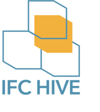

<div align="center" style="margin-top: 50px">
  
</div>

**AN DEN PROTOTYP FUND (2022-03-30)**  
_Wir haben das Projekt gerade erst aufgesetzt und wollten lieber diesen als gar
keinen Link in der Bewerbung mitschicken. Im Verlauf von April und Mai kommt
hier Bewegung rein._

_Der Regel für den Antrag selber folgend halten wir alle Texte zur Darstellung
des Projeks vorläufig auf Deutsch. Um der wachsenden Community an BIM und IFC
interessierten Entwicklern keine unnötigen Hürden in den Weg zu stellen schlagen
wir für den weiteren Projektverlauf Englisch als Geschäftssprache vor._  


# ifc-hive

**An Open BIM platform for sustainable data management based on the open IFC standard.**

Wir wollen einen Beitrag zu Open BIM leisten indem wir Bau- und
Planungsprojekten aller Größenordnungen sowie Betreibern von Immobilien
ermöglichen, ihre Bauwerksdaten vollständig IFC-konform zu verwalten. Im Sinne
der IFC Spezifikation beschränken wir uns dabei nicht auf Design und Austausch
der Gebäudegeometrie, sondern schließen die Abstraken und meist vernachlässtigen
oder proprietär implementierten abstraken Konzepte mit ein. Dazu gehören
Randbedingungen und Anforderungen in der Vorplanung, Emmissionswerte zu
Baustoffen, Gewerken und Baugruppen, Dokumente, Verantwortlichkeiten,
Gewährleistungen, Baustoffe Metadaten, Ausstattungs- und Einrichtungselemente. 

Die für BIM relevanten Formate COBie und BCF wollen wir ebenfalls unterstützen,
soweit sie Teil des IFC 4.0 Standards oder einer etablierten Erweiterung sind.
Vor allem im Betrieb und in der Sanierung von Bestandsgebäuden spielen beide
Formate eine wichtige Rolle für einen niederschwelligen Datenaustausch ohne
Medienbrüche.

Dieses Projekt ist zunächst ein Prototyp. Wir wollen einerseits ausgewählte
Anwendungsfälle so vollständig abbilden, dass die Plattform umgehend produktiv
genutzt werden kann. Gleichzeitig wollen wir mit diesem Prototyp aber auch
darstellen, wie ein offenes, anschlussfähiges, zukunftsfähiges BIM Common Data
Environment (CDE) funktionieren kann. Ein derart offenes und nachhaltiges CDE
ist nach unserer Auffassung eine notwendige Voraussetzung für eine
funktionierende, praktische Umsetzung von Open BIM. 

Wir sehen uns als Teil einer wachsenden, innovativen Community, die genau daran
arbeitet. Im Abschnitt [Andere interessante IFC und BIM
Projekte](https://repo.karo.design/daniel/ifc-hive#andere-interessante-bim-und-ifc-projekte)
listen wir einige aus unserer Sicht bemerkenswerte und inspirierende Projekte
auf.

# Zielgruppen

Wer kann was mit dem Ergebnis dieser Prototypentwicklung anfangen?

Im Rahmen einer zeiltlich begrenzten und ergebnisorientierten
Prototypentwicklung wollen richten wir uns vor allem Nutzer mit in verschiedenen
Anwendungsfällen mit Bestandsgebäuden umgehen.

1. Migration von Bauwerksdaten zu BIM / IFC
2. Grundlagenerfassung von Bestandgebäuden
3. Ausplanung von Räumen, Etagen oder ganzen Gebäuden
4. IFC konforme Verwaltung von Immobilienportfolio
5. Datenlage für energetische Gebäudesanierung schaffen und pflegen.

# Quickstart

Die Entwicklungsumgebung ist Docker-basiert und lässt sich mit den folgenden
Kommandos hochfahren bzw. restlos wieder entfernen.

```bash
# spin up docker based development environment
git clone git@repo.karo.design:daniel/ifc-hive.git
cd ifc-hive
docker-compose up --build -d

# tear down including all volumes
docker-compose down -v
```
Nach erfolgreichem Start sind die folgenden Services erreichbar:

1. http://localhost:8081 (web client)
2. http://localhost:3000 (API)
3. http://localhost:3000/docs (Auto generated API documentation)
4. http://localhost:8089 (Documentation Website)

# Arbeitsweise

Wichtige Aspekte für die Zusammenarbeit im Projekt sind im [Contribution
Guide](CONTRIBUTING.md) dargestellt.

# Komponenten

Die Plattform besteht im wesentlich aus drei Komponenten:

1. ifc-hive-server — REST API, GraphQL, socket-server
2. ifc-hive-client — Browser Web App
3. ifc-hive-docs — Technische Dokumentation und Projektdarstellung

Im Betrieb kommen mit einem Reverse Proxy (z.B. nginx) und einem persistenten
Logging Service (z.B. Logstash / Kibana) noch weitere Komponenten hinzu.
Außerdem gibt es noch sekundäre Services, z.B. Container für API
Integrationstests und End-to-End Testing der Web App. Grundsäzlich lassen sich
diese sekundäre Komponenten aber auch ganz anders integrieren, je nach
Deployment Infrastruktur.

# Konzept

## IFC und Graphdatenbank

## Prämissen und technische Ansätze

## Verwendete Technologien

Die verwendeten Technologien werden alle als Bestandteil der Enwicklungs oder
Produktionsumgebung mit ausgeliefert oder automatisch installiert. 

- **ifc-hive-client**
  - [vue 3.0](https://vuejs.org/) Reactive framework web app 
  - [vuetify 3](https://next.vuetifyjs.com/en/) UI Component Library for Vue 3
  - [three.js](https://threejs.org/) Javascript 3D WebGL library
  - [ifc.js](https://github.com/IFCjs) Open source IFC library  
  - [vitejs](https://vitejs.dev/) Lean fron-end tooling for Vue Apps
  - [vitest](https://vitest.dev/) front-end testing framework including Vue component testing
  - [cypress](cypress) additional browser based end-to-end testing
- **ifc-hive-server**
  - [nodejs](https://nodejs.org/en/)
  - [fastify](https://www.fastify.io/) Lean nodejs web framework with excellent performance as the basis for our API and application Layer.
    - see also the [fastify ecosystem](https://www.fastify.io/ecosystem/)
  - [tap](https://node-tap.org/) lean testing framework for unit tests
  - [superTest](https://github.com/visionmedia/supertest) API testing
  - [swagger / openAPI 3.0](https://swagger.io/docs/) openAPI 3.0 compliant API documentation
  - [ifc.js](https://github.com/IFCjs) Open source IFC library
  - [ifcOpenShell](http://ifcopenshell.org/) open source ifc toolkit and geometry engine
- **Database and Storage**
  - [neo4j](https://neo4j.com/) graph database as primary database technology.
  - [redis](https://redis.io/) in memory data store for the management of socket connections and efficient access control  
  - [elasticsearch](https://www.elastic.co/de/elastic-stack/) for full-text search and meta-data aggregations and indexing of key IFC concepts as denormalized, composed entities.
- **Tools**
  - [eslint](https://eslint.org/) Code Linting
  - [snyk.io](https://snyk.io/) Security Auditing
  - [prettier.io](https://prettier.io/) Auto formatting code
  - [nyc](https://github.com/istanbuljs/nyc) Code coverage
- **Deployment und Infrastruktur** 
  - [Gitlab and gitlab-runner](https://docs.gitlab.com/runner/) for code management and deployment to test and integration environment.
  - [Docker and docker-compose](https://www.docker.com/) for development environment and as deployment format.
  - [nginx](https://www.nginx.com/) as reverse proxy and public facade
  - [letsencrypt](https://letsencrypt.org/de/) and [certbot](https://certbot.eff.org/) as default option to handle TSL/SSL certificates.
  - [logstash](https://www.elastic.co/de/logstash/) and [kibana](https://www.elastic.co/de/kibana/) docker container logs are pushed via logstash to central logging service.


# Roadmap

Siehe auch [Meilensteine](https://repo.karo.design/daniel/ifc-hive/-/milestones) für detaillierte Beschreibungen.

1. [Detailkonzept und technische Planung](https://repo.karo.design/daniel/ifc-hive/-/milestones/1)
    - **Ergebnis** Detailkonzept, User Stories, Systemarchitektur, technische, Planung,API Design in OpenAPI 3.0,
2. [Front-End Basis](https://repo.karo.design/daniel/ifc-hive/-/milestones/3)
    - **Ergebnis** Globale UX/UI Komponenten, Framework, globale Komponenten,
      Sockets, API client, Error Handling etc.
3. [API und Back-End Basis](https://repo.karo.design/daniel/ifc-hive/-/milestones/2)
    - **Ergebnis** Basis-Implementierung, Security, API für User und Security Management, Integration von neo4j, Redis, Elasticsearch, DevOps Basics, 
4. [IFC Graph Operationen Schlüsselkonzepte](https://repo.karo.design/daniel/ifc-hive/-/milestones/4)
    - **Ergebnis** IFC Dateien bzw. Data Streams werden effizient als Graph
  verarbeitet und in neo4j gespeichert. Basisoperationen zur Bearbeitung des
  Graphen und performante Transformation in beide Richtungen ist implementiert. 
5. [Front-End interaktiver IFC Viewer](https://repo.karo.design/daniel/ifc-hive/-/milestones/5)
    - **Ergebnis** Erweiterung von ifc/web-ifc-viewer und auf Basis von three.js
      manipulation von Bauwerksdaten, isolierte Darstellung von Etagen und
      einzelnen Räumen, und Baugruppen nach Kategorien, dynamischer Querschnitt
      durch Modell, Bearbeitung von Meta-Daten.
6. [Early Alpha Basis-Anwendungsfällen](https://repo.karo.design/daniel/ifc-hive/-/milestones/6)
    - **Ergebnis** Erste Rohversion aller Komponenten, zentrale Anwendungsfälle
     sind implmentiert. IFC Dateien können importiert, neu erstellt, bearbeitet
     und dargestellt werden. Mit Graph-Operationen können Teilgraphen isoliert
     werden und Suchen über Attribute und Relationen ausgeführt werden.
7. [IFC Projekt Management und Versionskontrolle](https://repo.karo.design/daniel/ifc-hive/-/milestones/7)
    - **Ergebnis** Die Basisoperationen sind um einfache, git-ähnliche Operationen
  zur Verwaltung des digitalen Zwillings erweitert. Es können Teilgraphen an
  Fachplaner herausgegeben und nach Bearbeitung wieder integriert werden. Die an
  Git angelehnten Konzepte Commit und Tag und das identifizieren und Lösen von
  Merge-Konflikten ist umgesetzt.
8. [Front-End feature complete](https://repo.karo.design/daniel/ifc-hive/-/milestones/9)
    - **Ergebnis** Front-End Prototyp ist bezogen auf die geplanten Anwendungsfälle vollständig. Qualitätsicherung und Dokumentation sind abgeschlossen.
9. [API feature complete](https://repo.karo.design/daniel/ifc-hive/-/milestones/8)
    - **Ergebnis** API und Back-End sind vollständig im Sinne der Planung
      implementiert. Qualitätssicherung und Dokumentation sind abgeschlossen.
10. [Prototype Release Candidate (QA)](https://repo.karo.design/daniel/ifc-hive/-/milestones/10)
    - **Ergebnis** User Acceptance Testing mit Fokusgruppe, Evaluierung aller Anwendungsfälle, Verbesserungen, Optimierungen Deployment, Online Nutzer-Handbuch  etc.
11. [Prototyp Release](https://repo.karo.design/daniel/ifc-hive/-/milestones/11)
    - **Ergebnis** Inbetriebnahme des Prototypen bei Fokusgruppe, Bereistellung der
      Plattform an die öffentliche Verwaltung über den https://www.fitko.de/.
      Marketing des Projekts an weitere Zielgruppen, z.B. Schulträger für
      Umsetzung Digitalpakt, institutionelle Bauherren und Betreiber von
      Immobilien.


# Diskussion und weiterführende Literatur

- Afsari, Eastman, Castro-Lacouture, Javascript Object Notation (JSON) data
  serialization for IFC schema and web-based-BIM data exhange, Automation in
  Construction 77 (2017) 24-51
- Bolognesi, Villa, From Building Information Modelling to Mixed Reality,
    Springer (2021)
- Michael Jäger, VCS 4 CDE - Version Control Systems as Common Data
    Environments, 2018, Report Advanced Topics in Building Information Modeling
- Borrmann, König, Koch, Beetz, Building Information Modelling, Technology
    Foundations and Industry Practice, Spriner (2018) 
- Ismael, Application of graph databases and graph theory concepts for advanced
    analysing of BIM models based on IFC standard, Converence Paper (2017)
- Ismael, Building Knowledge Extraction from BIM/IFC Data for Analysis in Graph
    Databases, 2018, DOI: 10.1007/978-3-319-91262-2_57
- Kameli et al., Improving maintanance performance by developing an IFC BIM/
    RFID-based computer system, (2020), Journaal of Ambient Intelligence and
    Humanized Computing (2020), https://doi.org/10.1007/s12652-020-02464-3
- Ofluoglu, Ozener, Isikdag, Advances in Building Information Modeling, Revised
    Selected Papers, Springer (2019) Communications in Computer and Information
    Science 1188
- Sacks et al., BIM Handbook, A guide to Building Information Modeling for
    Owners, Designers, Engineers, Contractors, and Facility Managers, Third
    Edition, Wiley (2017)
- Scherer, Schapke, Informationssystem im Bauwesen 1, Modelle, Methoden und
    Prozesse, Springer Vieweg 2014
- Scherer, Schapke, Informationssystem im Bauwesen 2, Anwendungen, Springer Vieweg 2014
- Yitmen, BIM-enabled Cognitive Computing for Smart Building Environment,
    Potential, Requirements, and Implementation, CRC Press, Tayloer & Franis
    Group (2021)

# Andere interessante BIM und IFC Projekte

__[Speckle](https://speckle.systems/)__  

Eine innovative Open Source Lösung zur Echtzeit-Kommunikation von 3D Designs.
Mittels nodejs streams, sockets und an Git angelehnten Konzeption können Nutzer
an Speckle Streams partizipieren. Es können ganze Modelle oder auch nur Teile in
einen Stream per »commit« samt Nachricht gepusht werden. Die Speckle
Entwickler-Community stellt für viele wichtige CAD Autorensoftware Konnektoren
bereit (AutoCAD, Rhino, Unreal, Blender, Unity). 

__[BlenderBIM](https://blenderbim.org/)__

BlenderBIM ist gestartet als heroischer Alleingang von Dion Moult, der auszog
den IFC Standard als native Datenstruktur in Blender zu implementieren. Auf
Basis von Blender ist dabei ein sehr ernstzunehmendes Open Source BIM Werkzeug
entstanden, das IFC besser unterstützt als jegliche kommerzielle Plattform. 

Das Projekt wurde inzwischen von der Organisation, die IFC wesentlich
vorantreibt mit dem Building Smart Award 2020 ausgezeichnet, wird vom Epic
MegaGrants und Google Summer of Code unterstützt.

__[ifc.js](https://ifcjs.github.io/info/)__

BIM und IFC Toolkit für Javascript. Kaum eine Plattform zu BIM/IFC, sei es
kommerziell oder Open Source kommt ganz ohne diese Bibliothek aus. 

__[ifcOpenShell](http://ifcopenshell.org/)__

IfcOpenShell ist eine extrem nützliche und low level Bibliothek für C++ und
Python. Das oben erwähnte BlenderBIM nutzt diese Bibliothek bzw. befruchten sich
die Projekte mittlerweile gegenseitig.


